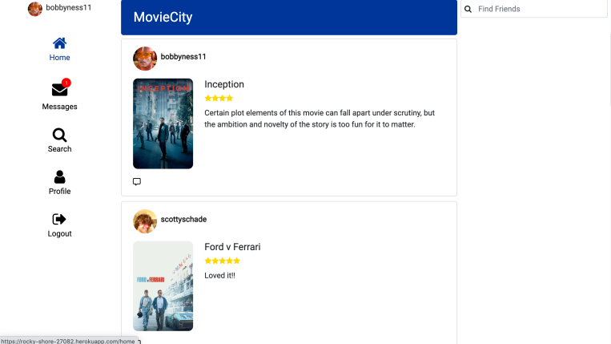

# MovieCity 1.0

> Social Network to search, review, and share movies with friends.

This is a MERN stack application. It is a small social network app that includes authentication, timelines for reviews, favorites, and movies to-watch, and messaging for recommending movies to friends.

# Quick Start 🚀

### Install server dependencies

```bash
npm install
```

### Install client dependencies

```bash
cd client
npm install
```

### Run both Express & React from root

```bash
npm run dev
```

### Build for production

```bash
cd client
npm run build
```

## Features

See your and friends reviews displayed in your main feed.



### Author

Bobby Schade
[Portfolio](http://www.bobbyschade.com)

### Version

1.0.0

### License

This project is licensed under the MIT License
